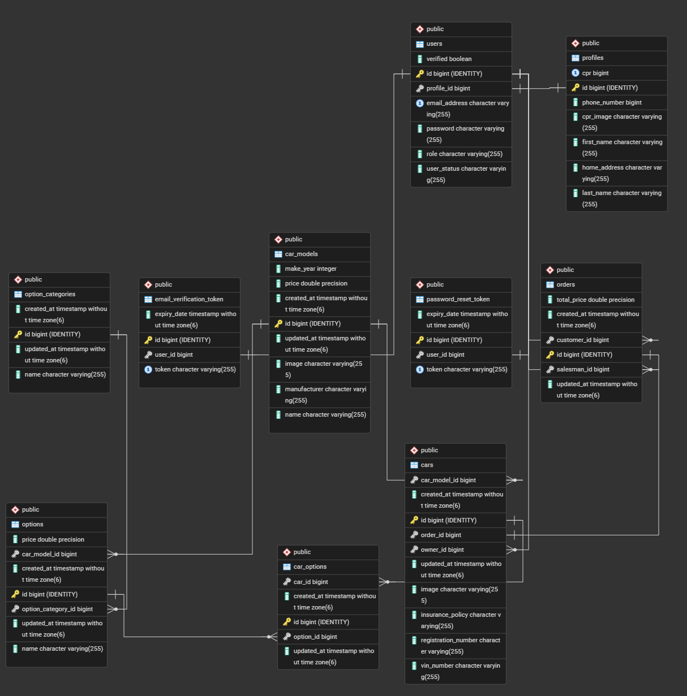

# Car Sales API
General Assembly unit 2 project; a team project for a car showroom app for selling brand vehicles
with customization(s) from available catalogue. The test data is for a Ferrari showroom selling the Ferrari F80 car model. 

## Tools & Technologies
- JAVA 17 with Spring Boot 4.0.1 Framework
- Spring Initializr (https://start.spring.io)
- Spring Boot features (WebMVC, DevTools, Data JPA, Security, Mail)
- Lombok for reducing boilerplate
- PostgreSQL Database with PgAdmin 4 dashboard
- Postman for API Testing
- JWT (JSON Web Tokens) for authentication
- LibrePDF for Invoice e-mail
- SmartDraw ERD app (trial period)
- GitHub with [GitHub Kanban Project Board](https://github.com/users/falansari/projects/12/views/1)
- Copilot for debugging support

## Entity Relationship Diagram
Note some changes were made after this ERD was drawn, but access to the ERD was lost due to a paid app gating. 

## Team Members
- Fatima Abdulla Alansari
  - Git & project Management
  - App Logic & Development:
    - Services & Controllers
    - Exception handling
    - File downloads and delete
    - Order requests
  - Pull Request Reviews
  - ERD Design
  - Testing & Data Entry
  - JavaDoc & Documentation
- Nadia Husain
  - User Management System:
    - Security management
    - Registration
    - Login
    - Password management
    - E-mail verification
    - Soft delete users
  - File uploads
  - Pull Request Reviews
  - Testing
  - Endpoints Documentation
- Sara Jalal
  - ERD Design
  - URL Endpoints Design
  - Data Models
  - Order Invoice E-mail

## API Endpoints

### User "/auth/users"
- createUser: POST /register
- loginUser: POST /login
- changePassword: PUT /change-password
- updateProfile: PUT /update-profile
- forgotPassword: POST /forgot-password
- resetPassword: POST /reset-password
- updateUserRole: PATCH /change-role
- verifyEmail: POST /verify
- softDeleteUser: PATCH /soft-delete/{userId}
- reactivateUserAccount: PATCH /reactivate/{userId}
- getUserById: GET /{userId}
- getCPRImage: GET /image/{userId}

### Car "api/cars"
- getCarById: GET /{carId}
- getCarByRegistrationNumber: GET /registration/{registrationNumber}
- getCarByInsurancePolicy: GET /insurance/{insurancePolicy}
- getCarByVinNumber: GET /vin/{vinNumber}
- getCars: GET "api/cars"
- getCarsByModel: GET /model/{modelId
- updateCar: PATCH /{carId}
- getImage: GET /image/{carId}

### Car Model "api/car-models"
- getCarModelById: GET /{carModelId}
- getCarModelByName: GET /name/{carModelName}
- getAllCarModels: GET "api/car-models"
- getAllCarModelsByYear: GET /year/{year}
- getAllCarModelsByYearBetween: GET /years
- getAllCarModelsByManufacturer: GET /manufacturer
- getAllOptionsByCarModelId: GET /{carModelId}/options
- getAllCarsByCarModelId: GET /{carModelId}/cars
- createCarModel: POST "api/car-models"
- updateCarModel: PATCH /{carModelId}
- deleteCarModel: DELETE /{carModelId}
- getImage: GET /image/{carModelId}

### Car Option "api/car-options"
- getAllCarOptions: GET "api/car-options"
- getCarOptionById: GET /{carOptionId}
- getCarOptionByOptionIdAndCarId: GET /option/{optionId}/car/{carId}
- getCarOptionsByOptionId: GET /option/{optionId}
- getCarOptionsByCarId: GET /car/{carId}
- createCarOption: POST "api/car-options"

### Option Category "api/option-categories"
- getOptionCategoryById: GET /{optionCategoryId}
- getOptionCategoryByName: GET category/{categoryName}
- getAllOptionCategories: GET "api/option-categories"
- createOptionCategory: POST "api/option-categories"
- updateOptionCategory: PATCH /{optionCategoryId}
- deleteOptionCategory: DELETE {optionCategoryId}

### Option "api/"
- getOptions: GET car-models/{carModelId}/option-categories/{optionCategoryId}/options
- getOptionById: GET options/{optionId}
- getOption: GET car-models/{carModelId}/option-categories/{optionCategoryId}/options/{optionId}
- createOption: POST car-models/{carModelId}/option-categories/{optionCategoryId}/options
- updateOption: PATCH car-models/{carModelId}/option-categories/{optionCategoryId}/options/{optionId}

### Order "api/orders"
- getAllOrders: GET api/orders
- getOrderById: GET /{orderId}
- getOrdersByOrderDate: GET /date/{orderDate}
- getOrdersByCustomerId: GET /customer/{customerId}
- getOrdersBySalesmanId: GET /salesman/{salesmanId}
- getOrdersByOrderDateBetween: GET /between
- createOrder: POST api/orders

## Setup Instructions
1. [Clone the repository](https://github.com/falansari/GA-project-02-car_showroom_app.git)
2. Create an empty database named Showroom in pgAdmin 4
3. Execute the data.sql file in docs folder in your database's query tool
4. Copy application-example.properties file, and name the copy application.properties, and update the details inside for your connection info
5. You can set up your own PostMan endpoints or use [this link](https://fatima-a-alansari-2491005.postman.co/workspace/JDB-PT-01~1df33fc2-4665-40ca-b39e-984c9ae80813/collection/50802600-76c07528-92ea-4577-a9cd-aae0ea66a8c9?action=share&creator=50802600)

## Implemented Features List
- Persisting 10 models.
- Environment settings with Spring Profiles.
- All of your API's endpoints must be able to perform complete CRUD operations such as create, read, update, and delete (If, it makes logical sense according to business use-case).
- Provide CRUD routes that were built based on rest conventions to be exposed as part of the API.
- Be able to gracefully handle exceptions when they occur.
- In the event that an exception occurs, you should send appropriate error messages back to the user.
- A combination of Spring Security and JWT tokens is required in order to authenticate and personalize API endpoints while maintaining the overall security of the application.
- The routes should be protected by JWT, except for those that perform user logins and sign-ups, which should be exposed via APIs.
- Role Management: 3 different types of users.
- Email verification Users needs to validate their email before being able to log in.
- File Upload Feature Users should be able to upload single images.
- Soft Delete Deleting the user with the admin role should do soft-delete. (userStatus = InActive)
- Forget Password/ Password Recovery Users should be able to recover the account in case they forget the password.
- Change Password User should be able to change the password.
- User Profile User should be able to update his/her own profile including profile picture.
- Seed File Seed the database before running your application for the first time.
- Create Order feature for ordering new vehicles and receiving an e-mail invoice.

## Other Qualities
- Don't code in the main branch for the whole development of your code-progression, use different branches. 
- Ensure that KISS principles are adhered to and that DRY principles are followed. 
- In order to make the application conform to the MVC and 3 tier design patterns, you need to have separate controller, model, repository and service layers. 
- It is imperative that you document each method that you develop. To put it simply, use doc strings and inline comments. 
- It is strongly recommended that you do not submit dangling code aka unused code as part of this submission. 
- Make sure to properly format your code for better readability. It's important not to invent your own documentation style, Java docstrings should suffice and inline comments should be included.

## General Approach to Development
We organized all individual tasks in the GitHub Project Kanban board, and each person chose the tasks they want to do 
and assigned themselves to them. Each issue gets its own temporary branch that gets worked on independently,
then merged after a Pull Request review by another team member.

## Unsolved Problems
- Generate image through a third party API was attempted as a feature add-on however all the APIs were paid only or too restrictive for our use case so it couldn't be implemented.

## Overcome Major Hurdles
- Forget/Reset Password feature was challenging due to having multiple steps such as sending email, generating token, updating user password etc. We managed to overcome this by seeking help from the instructor assistant.
- Overcame merging conflicts with good communication.
- Early on there were a lot of git conflict issues, they were resolved by adding stricter contribution rules and updating the .gitignore file to include OS-specific files and other setting files.
- The addition of Spring Security hijacked the custom exception messages we had made originally, but we fixed that by adding a GlobalExceptionHandler.
- The work load was excessive as it's quite a large app concept, but we pushed it through.